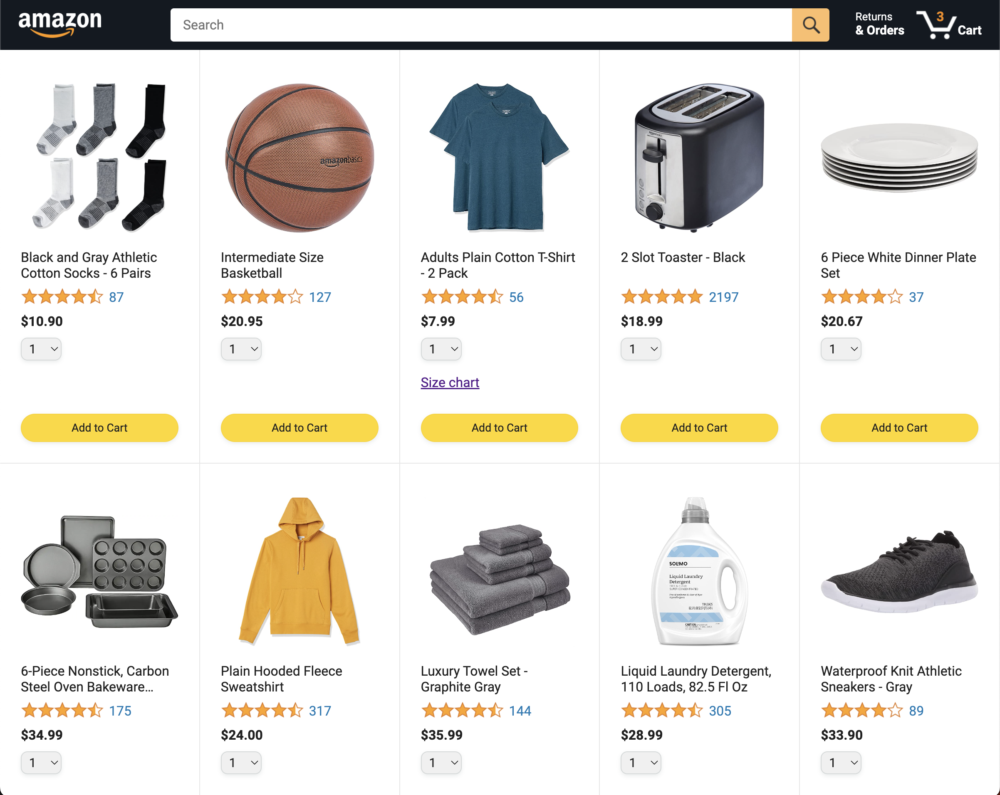

# Javascript Tutorial Full Course - Amazon project

This an Amazon clone as a sample project that helps to improve and understand javascript concepts from the [JavaScript Tutorial Full Course - Beginner to Pro (2024)](https://www.youtube.com/watch?v=EerdGm-ehJQ) tutorial by [SuperSimpleDev](https://www.youtube.com/@SuperSimpleDev).

## Table of contents

- [Overview](#overview)
  - [The challenge](#the-challenge)
  - [Screenshot](#screenshot)
  - [Links](#links)
- [My process](#my-process)
  - [Built with](#built-with)
  - [What I learned](#what-i-learned)
  - [Continued development](#continued-development)
- [Author](#author)

## Overview

### The challenge
Users should be able to:
- Perform CRUD operations on the webpage.

### Screenshot

### Links

- Solution URL: [SuperSimpleDev](https://supersimple.dev/projects/amazon/)
- Repo URL: [Github](https://github.com/alonsovzqz/js-amazon-project)

## My process

### Built with

- HTML5
- Flexbox & Grid
- Javascript

### What I learned

I learn from the very basics of Javascript. Meaning from creating variables to complex topics like async/await operations, promises and make calls to an API.

Also was able to create unit tests using Jasmine library.

### Continued development

I'd like to take this to a whole new level using React.js but first, need to finish the orders and tracking pages that still work in progress.

## Author

- Github - [Alonso Vazquez](https://github.com/alonsovzqz)